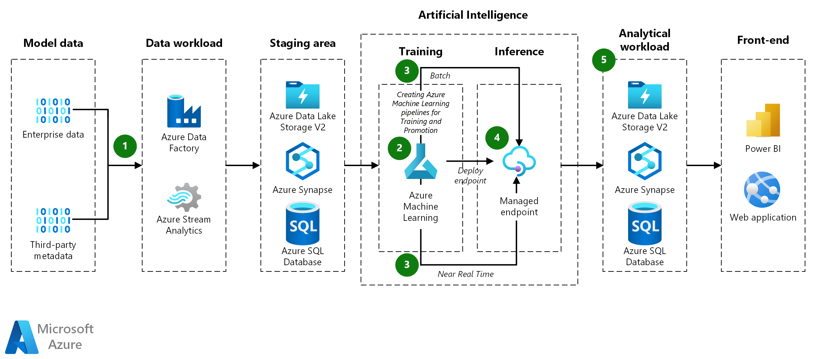

# Machine Learning Operations (MLOps) by DataScienceWorld.Kan

This repo focuses on constructing a CI/CD pipeline using Azure DevOps, specifically tailored for machine learning applications. The process includes the following key steps:

- Establishing the infrastructure within an Azure ML workspace
- Connecting to an Azure ML workspace
- Managing datasets and datastores
- Training a machine learning model
- Deploying the model to an endpoint
- Testing the model's performance.
  

Source: [Learn about Many Models Machine Learning with Azure](https://learn.microsoft.com/en-us/azure/architecture/ai-ml/idea/many-models-machine-learning-azure-machine-learning)

